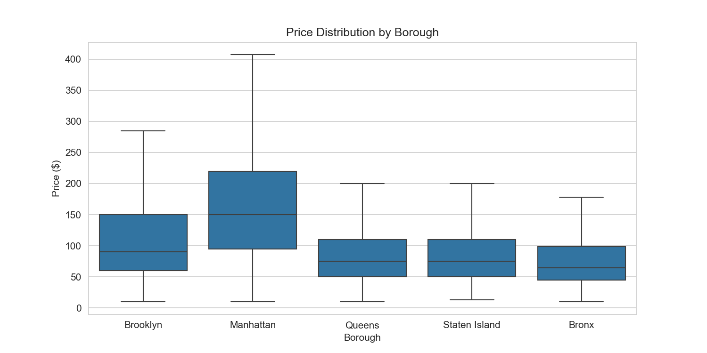
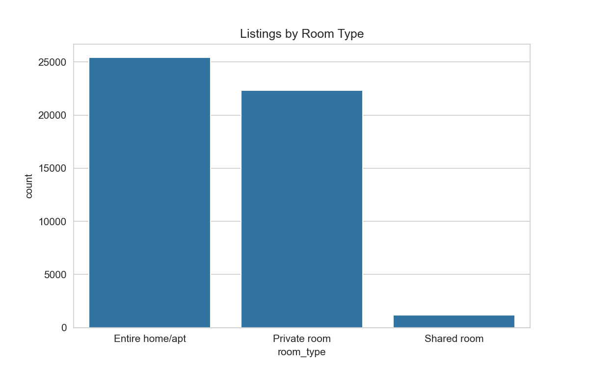
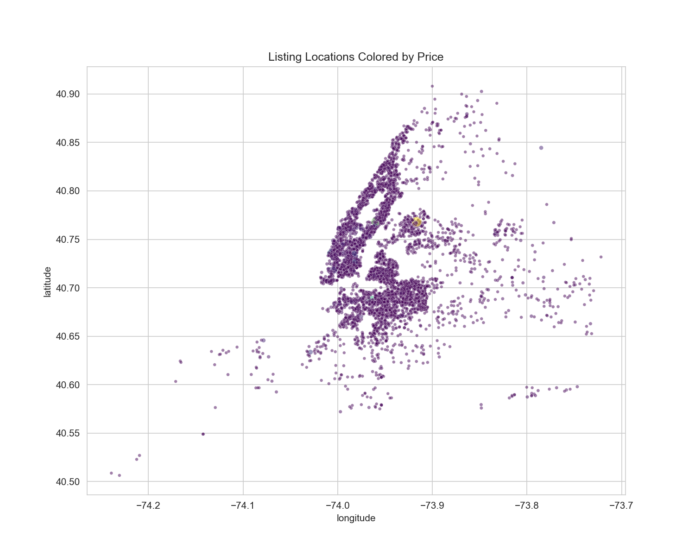
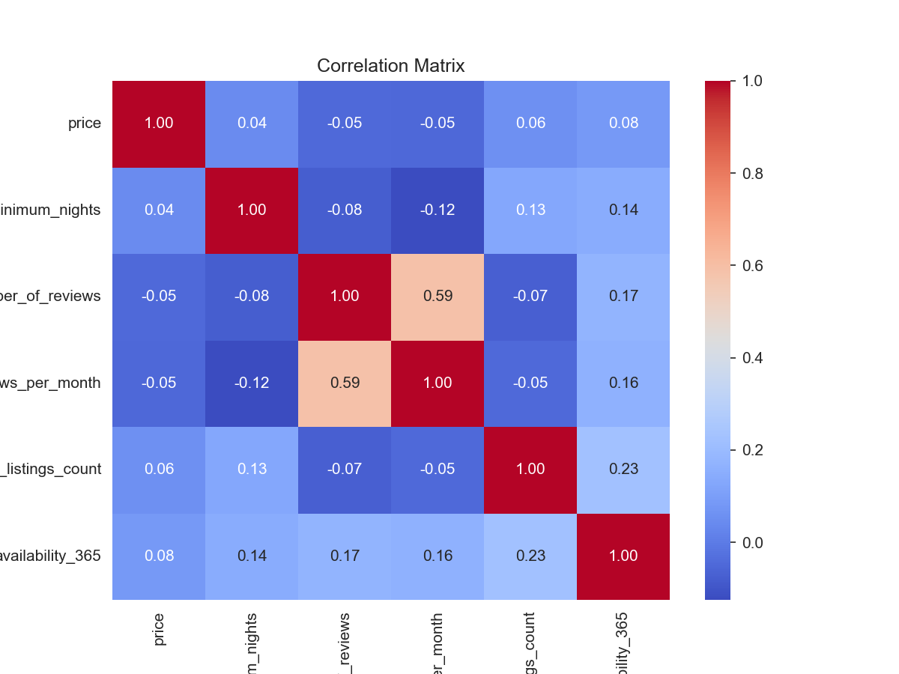

# NYC Airbnb Listings Analysis

Exploratory analysis of the 2019 New York City Airbnb open dataset (~49,000 listings), covering data cleaning, exploratory analysis and visualisation in Python, followed by the same dataset loaded into SQL Server for query-based analysis.

## Dataset

AB_NYC_2019.csv — public Airbnb listings data for New York City, 2019. Columns include listing ID and name, host ID and name, borough (neighbourhood_group), neighbourhood, latitude/longitude, room type, price, minimum nights, review counts, host listing counts and yearly availability.

## Tools

- **Python** — pandas, NumPy, Matplotlib, Seaborn (Jupyter Notebook)
- **SQL Server** — T-SQL via SSMS
- **Excel** — cleaned dataset export

## What the project does

**1. Data cleaning (Python)**
- Filled missing values in name, host_name and reviews_per_month
- Stripped whitespace and standardised casing in text columns
- Converted last_review to a proper datetime type
- Removed listings with a price of zero
- Created a filtered copy with the top and bottom 1% of prices removed, so outliers don't distort the charts
- Engineered two new features: price_per_night_category (Budget / Mid / High / Luxury / Premium) and days_since_last_review

**2. Exploratory analysis (Python)**
- Price distribution by borough and by room type
- Top 10 neighbourhoods by listing count
- Availability, review counts and minimum-nights distributions
- Correlation matrix across the numeric features
- Geographic scatter plots of listings coloured by price and by borough
- Host concentration: share of listings owned by hosts with more than one property

**3. SQL analysis (SQL Server)**
The cleaned dataset was loaded into `AirbnbAnalysisDB` and the script:
- Validates every column with `TRY_CAST` before converting types, and fixes European-style decimal commas in `price`, `reviews_per_month`, `latitude` and `longitude`
- Converts all columns from text to their correct types (`FLOAT`, `INT`, `DATETIME2`)
- Reproduces the key analysis in T-SQL: average and median price per borough, room type breakdown, top neighbourhoods, host concentration, busiest hosts, price category mix by borough, review activity, and a minimum-nights data quality check

## Key findings

<!-- Replace these with your actual numbers from the notebook output -->
- Manhattan has the highest median price of any borough; the Bronx and Staten Island the lowest
- Entire homes/apartments command roughly double the price of private rooms
- A meaningful share of listings belong to hosts with multiple properties, suggesting commercial rather than casual hosting
- Price correlates weakly with review count and availability — location and room type are the stronger drivers
## Visualisations

### Price by borough

Manhattan sits well above the other boroughs; the Bronx and Staten Island trail.

### Room type breakdown

### Listings mapped by price

### Correlation matrix

Other charts: [availability vs price](availability_vs_price.png) ·
[reviews vs price](reviews_vs_price.png) ·
[top neighbourhoods](top_neighborhoods.png) ·
[host concentration](host_listing_concentration.png) ·
[minimum nights](minimum_nights_dist.png) ·
[price category by borough](price_category_by_borough.png) ·
[before/after cleaning](AB_NYC_2019.CSV)

## Project files
 [Airbnb_Data_Analysis.ipynb](Airbnb_Data_Analysis.ipynb) | Cleaning, EDA and visualisation in Python |
 [Airbnb.sql](/Airbnb.sql) | Type conversion and analysis queries |
 [AB_NYC_2019.csv](AB_NYC_2019.csv) | Raw dataset |
 [AB_NYC_2019_cleaned.csv](AB_NYC_2019.csv) | Cleaned dataset used for SQL analysis |
